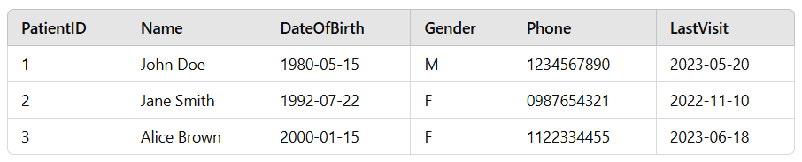
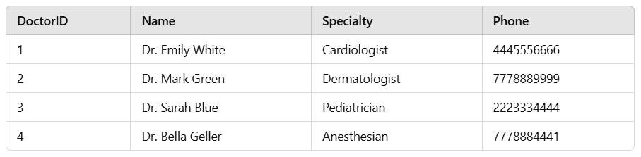
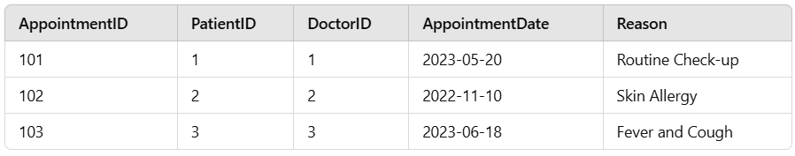

# Health-Management-System-SQL
A database system to manage patient records, doctor details, appointments, and prescriptions. Includes queries to retrieve appointment lists, doctor statistics, prescription details, and more.
## Dataset Tables

### Patients Table

### Doctors Table

### Appointments Table

### Prescriptions Table

